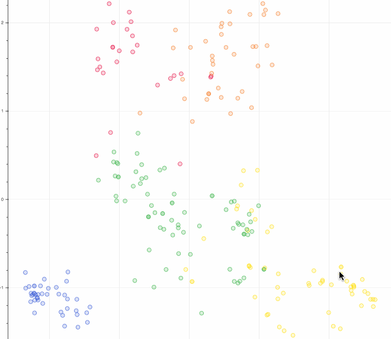

Global-Chem-Extensions: Functinality for applications of GlobalChem for Cheminformaticians.
===========================================================================================


[](https://opensource.org/licenses/MPL-2.0)


[](http://makeapullrequest.com)
[](https://www.python.org/dev/peps/pep-0008/)
[](https://zenodo.org/badge/latestdoi/459776043)
[](https://app.fossa.com/projects/git%2Bgithub.com%2FSulstice%2Fglobal-chem-extensions?ref=badge_shield)
[](https://pepy.tech/project/global-chem-extensions)

Global Chem is an open-source graph database and api for common and rare chemical lists using IUPAC as input and SMILES/SMARTS as output. As 
mostly needed by myself as I search through chemical infinity.

I have useful tools I use to analyze chemical data starting with functional groups. 

Installation 
============

GlobalChemExtensions is going to be distribute via PyPi and as the content store grows we can expand it to other pieces of software
making it accessible to all regardless of what you use. Alternatively, you could have a glance at the source code and copy/paste
it yourself.

```

pip install global-chem-extensions

```
Quick Start
===========

Just with no dependencies, intialize the class and there you go! All the common and rare groups of the world
at your disposal 

#### Use the Sunbursting Extensions

`dependencies`: `plotly`, `rdkit`, `kaleiodo`, `global-chem`

```python

from global_chem_extensions.global_chem_extensions import GlobalChemExtensions

test_set = [
    'c1[n+](cc2n(c1OCCc1cc(c(cc1)F)F)c(nn2)c1ccc(cc1)OC(F)F)[O-]',
    'c1nc(c2n(c1OCCc1cc(c(cc1)F)F)c(nn2)c1ccc(cc1)OC(F)F)Cl',
    'c1ncc2n(c1CCO)c(nn2)c1ccc(cc1)OC(F)F',
    'C1NCc2n(C1CCO)c(nn2)c1ccc(cc1)OC(F)F',
    'C1(CN(C1)c1cc(c(cc1)F)F)Oc1cncc2n1c(nn2)c1ccc(cc1)OC(F)F',
    'c1ncc2n(c1N1CCC(C1)c1ccccc1)c(nn2)c1ccc(cc1)OC(F)F',
]

GlobalChemExtensions().sunburst_chemical_list(test_set, save_file=False)

```

<p align="center">
  
</p>

#### PCA Analysis

Conduct PCA Analysis with a SMILES list input.

`dependencies`: `bokeh`, `rdkit`

```python

from global_chem.global_chem import GlobalChem
from global_chem_extensions.global_chem_extensions import GlobalChemExtensions

gc = GlobalChem()
gc = GlobalChem()
gc.build_global_chem_network(print_output=False, debugger=False)
smiles_list = list(gc.get_node_smiles('schedule_one').values())

mol_ids = GlobalChemExtensions().node_pca_analysis(
            smiles_list,
            morgan_radius = 1,
            bit_representation = 512,
            number_of_clusters = 5,
            number_of_components = 0.95,
            random_state = 0,
            file_name 'global_chem_pca.html',
            save_file=False,
            return_mol_ids=True,
)

```

<p align="center">
  
</p>

#### Conversion From Amino Acid to SMILES and Back Again

Convert from Amino Acids to SMILES and Back again just using a series of tricks of regexes :)

```python

amino_acid_test = ['RSTEFGHIKLADPQ']
smiles = GlobalChemExtensions().amino_acids_to_smiles(amino_acid_test)
print (smiles)

>>>
['NC(CCCCNC(N)=N)C(NC(CO)C(NC(C(C)([H])O)C(NC(CCC(O)=O)C(NC(CC1=CC=CC=C1)C(NC([H])C(NC(CC1=CNC=N1)C(NC(C(CC)([H])C)C(NC(CCCCN)C(NC(CC(C)C)C(NC(C)C(NC(CC(O)=O)C(NC(C2CCCN2)C(NC(CCC(N)=O)C(NCC(O)=O)=O)=O)=O)=O)=O)=O)=O)=O)=O)=O)=O)=O)=O)=O']

amino_acid = GlobalChemExtensions().smiles_to_amino_acids(smiles)
print (amino_acid)
>>>
['RSTEFGHIKLADPQ', None]

```
#### Science Open Source Database Monitors

This uses
Check the Open Source Database Monitors for Heartbeats: `www.chemistrydb.com`

```python

successes, failures = GlobalChemExtensions.check_status_on_open_source_databases()

```


```
 Zinc 15                                                  OpenFDA                                                      
 Zinc 20                                                  Metabolites Biological Role                                  
 PubChem                                                  MetaboAnalyst                                                
 NIST Chemistry Webhook                                   Adverse Drug Reaction Classification System                  
 Chem Exper                                               Metabolism and Transport Database                            
 NMR Shift Database                                       Ecology Toxicity                                             
 Drug Bank                                                Human and Environment Risk Assessment                        
 Binding Database                                         International Toxicity Information for Risk Assesments       
 Spectral Database for Organic Compounds                  Japan Exisiting Database                                     
 Sider                                                    National Pesticide Center                                    
 ChemSpider                                               Pesticide Info                                               
 Stitch                                                   Kyoto Encyclopedia of Genes and Genomes                      
 CardPred                                                 Hetereocycles                                                
 Comparative Toxicogenomics Database                      Chemical Resolver                                            
 AMED Cardiotoxicity Database                             LookChem                                                     
 Tox21                                                    Lipid Maps                                                   
 Drug Safety Analysis System                             
 
 ```                                                           
                                                         


## License

[](https://app.fossa.com/projects/git%2Bgithub.com%2FSulstice%2Fglobal-chem-extensions?ref=badge_large)
