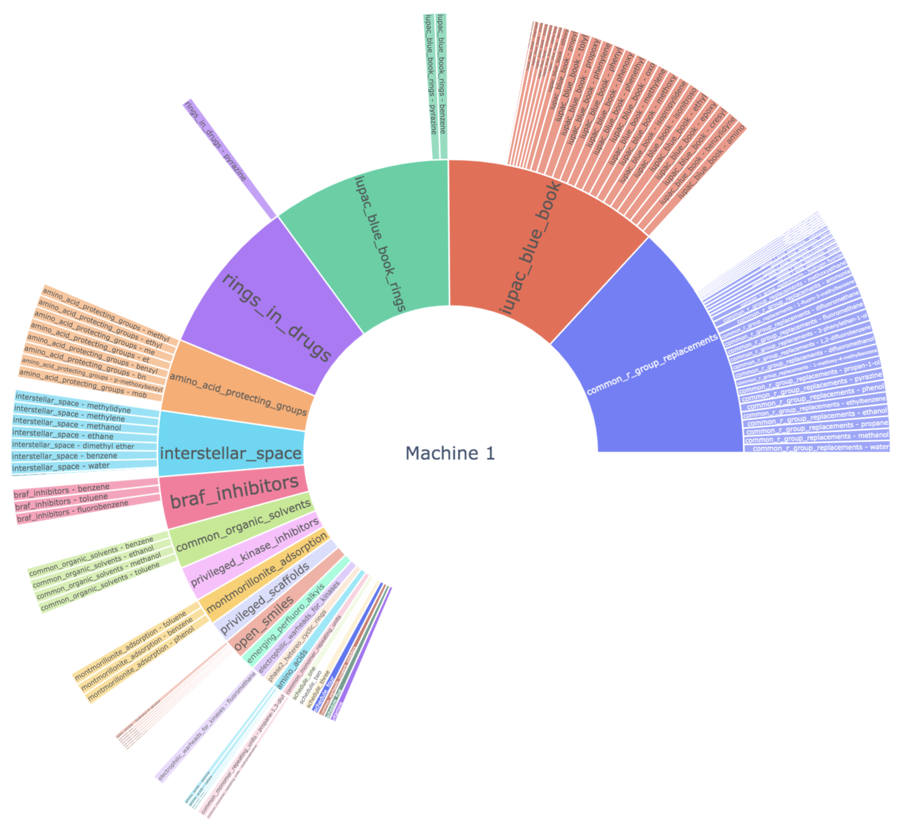

Global-Chem-Extensions: Functinality for applications of GlobalChem for Cheminformaticians.
===========================================================================================


[](https://opensource.org/licenses/MPL-2.0)


[](http://makeapullrequest.com)
[](https://www.python.org/dev/peps/pep-0008/)
[](https://zenodo.org/badge/latestdoi/459776043)

Global Chem is an open-source graph database and api for common and rare chemical lists using IUPAC as input and SMILES/SMARTS as output. As 
mostly needed by myself as I search through chemical infinity.

I have useful tools I use to analyze chemical data starting with functional groups. 

Installation 
============

GlobalChemExtensions is going to be distribute via PyPi and as the content store grows we can expand it to other pieces of software
making it accessible to all regardless of what you use. Alternatively, you could have a glance at the source code and copy/paste
it yourself.

```

pip install global-chem-extensions

```
Quick Start
===========

Just with no dependencies, intialize the class and there you go! All the common and rare groups of the world
at your disposal 

#### Use the Sunbursting Extensions

`dependencies`: `plotly`, `rdkit`, `kaleiodo`, `global-chem`

```python

from global_chem_extensions.global_chem_extensions import GlobalChemExtensions

test_set = [
    'c1[n+](cc2n(c1OCCc1cc(c(cc1)F)F)c(nn2)c1ccc(cc1)OC(F)F)[O-]',
    'c1nc(c2n(c1OCCc1cc(c(cc1)F)F)c(nn2)c1ccc(cc1)OC(F)F)Cl',
    'c1ncc2n(c1CCO)c(nn2)c1ccc(cc1)OC(F)F',
    'C1NCc2n(C1CCO)c(nn2)c1ccc(cc1)OC(F)F',
    'C1(CN(C1)c1cc(c(cc1)F)F)Oc1cncc2n1c(nn2)c1ccc(cc1)OC(F)F',
    'c1ncc2n(c1N1CCC(C1)c1ccccc1)c(nn2)c1ccc(cc1)OC(F)F',
]

GlobalChemExtensions().sunburst_chemical_list(test_set, save_file=False)

```

<p align="center">
  
</p>
